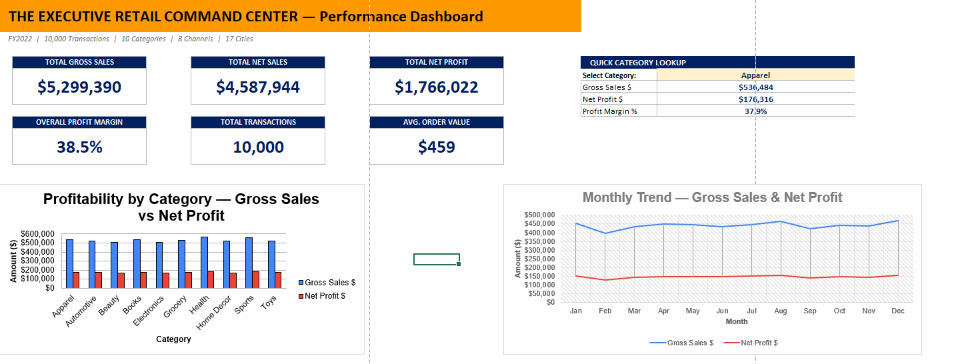
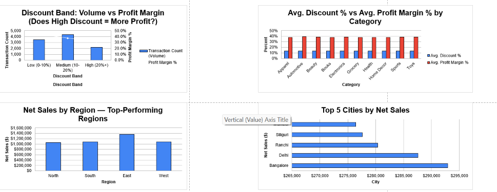
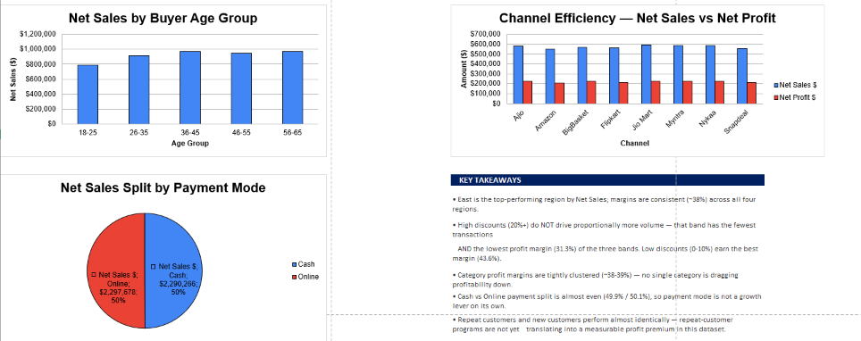
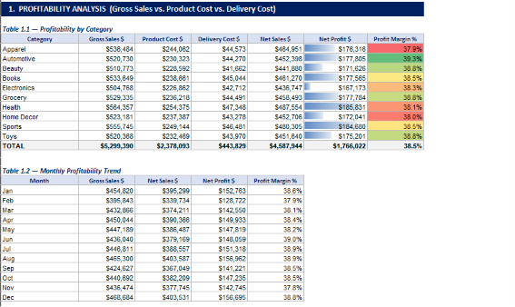
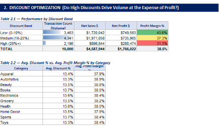
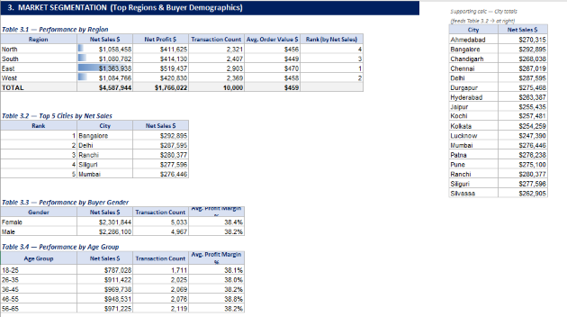
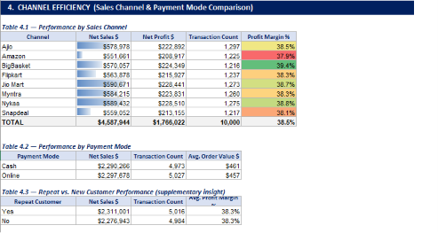
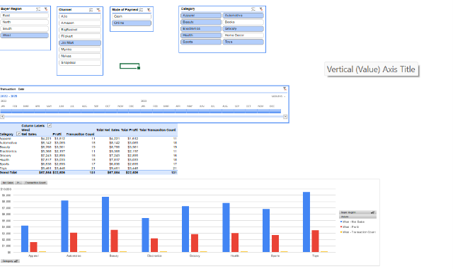

# The Executive Retail Command Center
### A 10,000-Transaction Retail Analytics Dashboard Built in Excel

[](#)
[](#)
[](#)

A capstone data analytics project that transforms 10,000 raw retail transaction records into a formula-driven executive dashboard — covering profitability, discount strategy, market segmentation, and channel performance for a multi-platform retail business (Amazon, Flipkart, Myntra, Ajio, and more).

---

## 📌 Project Overview

A global retail conglomerate operating across 8 online sales channels wants to optimize profitability. It faces open questions around discount strategy, regional performance, and channel efficiency. This project takes the raw transaction-level dataset and builds a full analytical layer on top of it — summary tables, KPI cards, and an interactive dashboard — to answer those questions with evidence rather than assumption.

**Dataset:** 10,000 unique transactions | FY2022 | 10 product categories | 8 sales channels | 17 cities | 19 data fields (transaction, product, financial, and demographic attributes)

---

## 🎯 Business Questions Answered

| # | Question | Answer |
|---|---|---|
| 1 | **Profitability** — How do gross sales, product cost, and delivery cost combine into net margin? | 38.5% blended margin across all categories |
| 2 | **Discount Optimization** — Do higher discounts drive proportionally more volume and profit? | No — high discounts reduce margin without adding volume |
| 3 | **Market Segmentation** — Which regions and demographics perform best? | East region and the 36–45 age group lead on net sales |
| 4 | **Channel Efficiency** — Which sales channel and payment mode perform best? | Margins are consistent (~37–39%) across all 8 channels |

---

## 📊 Key Metrics (FY2022)

| Metric | Value |
|---|---|
| Total Gross Sales | $5,299,390 |
| Total Net Sales | $4,587,944 |
| Total Net Profit | $1,766,022 |
| Overall Profit Margin | 38.5% |
| Total Transactions | 10,000 |
| Average Order Value | $459 |

---

## 🔑 Key Business Insights

- **East is the top-performing region** by net sales, with margins consistent (~38%) across all four regions — no region is structurally underperforming.
- **High discounts (20%+) do not drive proportionally more volume.** That band has the *fewest* transactions and the *lowest* margin (31.3%) of the three discount bands — low discounts (0–10%) earn the best margin (43.6%).
- **Category margins are tightly clustered (~38–39%)** — no single category is dragging down blended profitability.
- **Cash vs. Online payment split is nearly even** (49.9% / 50.1%), so payment mode is not, by itself, a growth lever.
- **Repeat and new customers perform almost identically** — repeat-customer programs aren't yet translating into a measurable profit premium in this dataset.

---

## 🖼️ Dashboard Walkthrough

### 1. Executive Overview
The command-center landing view — total sales, profit, margin, transaction volume, and average order value at a glance, plus a live category lookup.



### 2. Profitability Analysis
Gross sales, product cost, and delivery cost broken down by category and by month, with profit margin flagged category-by-category.



### 3. Discount Optimization
Tests whether higher discount bands actually convert into higher volume or profit — they don't.



### 4. Market Segmentation
Regional and demographic performance — net sales, profit, and average order value by region, city, gender, and age group.



### 5. Channel Efficiency
Net sales, net profit, and margin compared across all 8 sales channels and both payment modes.



### 6. Discount & Regional Visuals
Volume vs. margin by discount band, category-level discount-to-margin comparison, and top-performing regions/cities.



### 7. Demographic & Channel Visuals
Sales by buyer age group, channel-level net sales vs. net profit, and the cash/online payment split, alongside headline takeaways.



### 8. Interactive Pivot Dashboard
A slicer-driven pivot view for filtering by region, channel, payment mode, category, and transaction date.



---

## 🛠️ Tools & Techniques Used

- **Excel PivotTables & Pivot Charts** — dynamic, slicer-filterable summaries by region, channel, category, and payment mode
- **Formula-driven KPIs** — `SUMIFS`, `INDEX/MATCH`, `IFERROR` for all summary and lookup logic (no hardcoded results)
- **Slicers & Interactive Filters** — region, channel, payment mode, category, and transaction date
- **Dashboard Design** — KPI cards, conditional formatting (margin heat-mapping), and a category quick-lookup panel
- **Data Cleaning & Structuring** — 10,000-row transactional dataset organized into a single source-of-truth table feeding all downstream views

---

## 📁 Repository Structure

```
retail-analytics-capstone/
├── README.md
├── data/
│   └── SumitJha_Retail_Capstone.xlsx      # Full workbook: raw data, pivots, dashboard
└── assets/
    └── screenshots/
        ├── 01-executive-dashboard-overview.png
        ├── 02-profitability-analysis-table.png
        ├── 03-discount-optimization-table.png
        ├── 04-market-segmentation-table.png
        ├── 05-channel-efficiency-table.png
        ├── 06-discount-vs-profit-charts.png
        ├── 07-demographics-channel-charts.png
        └── 08-interactive-pivot-dashboard.png
```

---

## 👤 Author

**Sumit Kumar Jha**
MBA Candidate, IIM Udaipur (Class of 2026–28) | B.Tech Mechanical Engineering, IIT (ISM) Dhanbad
[LinkedIn](#) · [Email](#)

---

*This project was completed as a data analytics capstone exercise, using a simulated 10,000-transaction retail dataset to demonstrate end-to-end analysis: business framing, KPI design, discount and channel analysis, and dashboard construction in Excel.*
